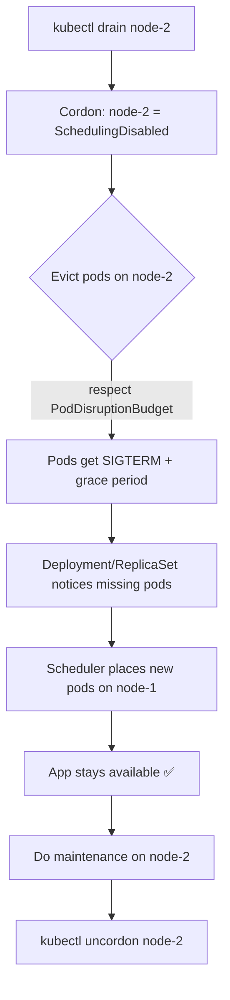

# 🧪 Lab 01 — How the Node Draining Process Works

> **Stage 5: Symbols** — The runnable answer to a classic interview question.
> Practice locally on **minikube**, then see the managed analog on **Fly.io**.

---

## ❓ The Interview Question

> *"Walk me through what happens when you drain a Kubernetes node."*

## ✅ The Answer

Draining a node is a **two-step automated process** that lets you safely take a node
out of service (for an upgrade, reboot, or decommission) **without dropping your workloads**.

### 1. Cordoning the Node (Marking as Unschedulable)

First, Kubernetes **cordons** the node. This tells the scheduler:

> *"Do not place any new pods on this node."*

Existing pods keep running for the moment — but no newcomers are allowed. The node's
status flips to `Ready,SchedulingDisabled`.

```bash
kubectl cordon <node-name>
```

### 2. Evicting the Pods

Next, Kubernetes begins **gracefully shutting down** the existing pods on that node.
Because most pods are managed by controllers (**Deployments, ReplicaSets, StatefulSets**),
the cluster notices these pods have vanished and **automatically recreates them on other
available nodes**.

```bash
kubectl drain <node-name> --ignore-daemonsets --delete-emptydir-data
```

> `drain` = `cordon` + graceful **eviction** of all evictable pods.

### What governs the eviction?

| Mechanism | Role during a drain |
|-----------|---------------------|
| **Graceful termination** | Pods get `SIGTERM`, then `terminationGracePeriodSeconds` before `SIGKILL` |
| **PodDisruptionBudget (PDB)** | Caps how many replicas can be down at once → keeps the app available |
| **Controllers** (Deployment/RS/STS) | Recreate the evicted pods on schedulable nodes |
| **DaemonSet pods** | Skipped unless `--ignore-daemonsets` (they belong to every node) |
| **Bare/unmanaged pods** | Block the drain unless `--force` (nothing would recreate them) |

When you're done with maintenance, **uncordon** to let pods land there again:

```bash
kubectl uncordon <node-name>
```

---

## 🔁 The Flow (diagram)



---

## 🖥️ Hands-On A — minikube (local, multi-node)

> Full script: [`run.sh`](./run.sh) · Manifests: [`deployment.yaml`](./deployment.yaml), [`pdb.yaml`](./pdb.yaml)

```bash
# 1. A 2-node cluster so pods have somewhere to go when one node drains
minikube start -p k8s-cert-qa --nodes 2

# 2. Deploy a 4-replica web app + a PodDisruptionBudget (minAvailable: 3)
kubectl apply -f deployment.yaml
kubectl apply -f pdb.yaml
kubectl rollout status deploy/draining-demo

# 3. See which node each pod is on
kubectl get pods -o wide

# 4. Pick the busiest non-control-plane node and DRAIN it
NODE=$(kubectl get pods -l app=draining-demo -o jsonpath='{.items[0].spec.nodeName}')
kubectl drain "$NODE" --ignore-daemonsets --delete-emptydir-data

# 5. Watch: node is SchedulingDisabled, pods rescheduled onto the other node
kubectl get nodes
kubectl get pods -o wide

# 6. Maintenance done — bring the node back
kubectl uncordon "$NODE"
```

**What you should observe**

- The drained node shows `Ready,SchedulingDisabled`.
- Pods that were on it are `Terminating`, then **new** pods appear on the other node.
- Because the PDB requires `minAvailable: 3`, the eviction respects availability — the
  drain proceeds only as fast as replacements come up.

> 💡 With a single-node minikube cluster, the drain has nowhere to move pods, so the PDB
> blocks eviction — exactly why the script uses `--nodes 2`.

---

## ☁️ Hands-On B — Fly.io (the managed analog)

Fly.io isn't Kubernetes, but it has the **same idea** under a managed surface: when a
host needs maintenance, Fly **migrates / restarts Machines** while keeping your service
up — the platform's version of cordon + evict + reschedule.

> App + Dockerfile live in [`fly/`](./fly/). Token comes from Azure Key Vault — never hardcoded.

```bash
# Pull the Fly deploy token from the EXISTING Azure Key Vault (no new vault)
export FLY_API_TOKEN=$(az keyvault secret show \
  --vault-name dp-kv-deliverypilot --name FLY-API-TOKEN --query value -o tsv)

cd fly
fly launch --no-deploy --name k8s-cert-qa-handson --copy-config
fly deploy

# Run TWO machines so there's redundancy during host maintenance (the "two nodes" idea)
fly scale count 2

# Inspect machines and roll/restart one (drain analog)
fly machine list
fly machine restart <machine-id>     # graceful stop + restart elsewhere
```

| Kubernetes (minikube) | Fly.io equivalent |
|-----------------------|-------------------|
| `kubectl cordon` | Host marked for maintenance / Machine `cordoned` internally |
| `kubectl drain` (evict) | `fly machine restart` / host migration moves the Machine |
| Deployment recreates pods | Fly restarts the Machine (same image) on a healthy host |
| PodDisruptionBudget | Run `fly scale count >= 2` so one Machine always serves |

---

## 🧠 Interview Follow-ups (be ready for these)

- **"What if a pod isn't managed by a controller?"** → `drain` refuses unless `--force`; nothing would recreate it.
- **"How do DaemonSet pods behave?"** → They're tied to the node; `drain` needs `--ignore-daemonsets`.
- **"How do you protect availability during a drain?"** → A `PodDisruptionBudget` (`minAvailable` / `maxUnavailable`).
- **"What's the difference between cordon and drain?"** → `cordon` only stops *new* scheduling; `drain` also *evicts* existing pods.
- **"How is a pod terminated gracefully?"** → `SIGTERM` → `preStop` hook → `terminationGracePeriodSeconds` → `SIGKILL`.

---

## 🧹 Cleanup

```bash
kubectl delete -f pdb.yaml -f deployment.yaml
minikube delete -p k8s-cert-qa
fly apps destroy k8s-cert-qa-handson   # if you deployed to Fly
```

See validation evidence in [`7_Testing_Known/`](../../7_Testing_Known/README.md).
